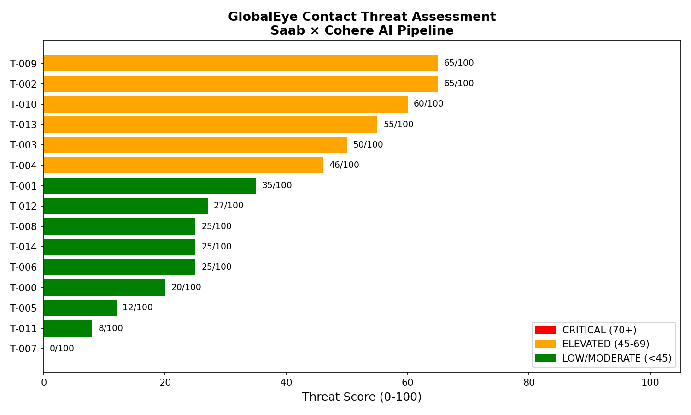

"Note: Sensor data in this project is simulated for demonstration purposes. In production this layer would connect directly to GlobalEye's Track Data Fusion Engine output."

# GlobalEye Multi-Modal Sensor Data Bridge — Cohere LLM Integration

> A proof-of-concept Data Science pipeline demonstrating how raw multi-modal aerospace sensor data from the **Saab GlobalEye AEW&C system** can be converted into structured natural language and fed into **Cohere's enterprise LLM** for real-time operator decision support.

---

## Background

In 2025, Saab and Cohere signed a Memorandum of Understanding (MOU) to explore AI integration within GlobalEye's mission support, maintenance, and information processing workflows — all within secure on-premises environments.

One of the core technical challenges of this collaboration is that **Cohere's LLMs speak language, but GlobalEye's sensors speak numbers, signals, and radar returns.** This project proposes and implements the **data bridge between those two worlds.**

---

## The Problem This Solves

| Challenge | Detail |
|---|---|
| Multi-modal gap | LLMs cannot directly interpret raw radar RCS values, bearing angles, or IR readings |
| On-premises constraint | All processing must run offline inside a secure aerospace environment |
| Real-time requirement | Operators need assessments in seconds, not minutes |
| Explainability | Every AI decision must be traceable and auditable |

---

## Pipeline Architecture

```
RAW SENSOR DATA (Erieye AESA, IR, AIS, SIGINT)
          │
          ▼
┌─────────────────────────┐
│  Layer 1: Data Ingestion │  ← Simulate or ingest live TDFE output
└──────────┬──────────────┘
           │
           ▼
┌──────────────────────────────┐
│  Layer 2: Feature Engineering │  ← Threat scoring, classification
└──────────┬───────────────────┘
           │
           ▼
┌────────────────────────────────────┐
│  Layer 3: Natural Language          │  ← THE KEY BRIDGE
│  Conversion (sensor_to_language)    │     Numbers → Text Cohere understands
└──────────┬─────────────────────────┘
           │
           ▼
┌──────────────────────────────┐
│  Layer 4: Cohere LLM Input   │  ← Command-R+ generates operator guidance
└──────────┬───────────────────┘
           │
           ▼
    OPERATOR DECISION SUPPORT
```

---
## Threat Assessment Dashboard



## Sensors Modelled

| Sensor | Data Produced |
|---|---|
| Erieye ER AESA Radar | Bearing, speed, altitude, radar cross-section (RCS) |
| Electro-Optical / IR | Infrared signature level |
| AIS Transponder | Vessel/aircraft identity, registration status |
| Zone Monitoring | Airspace zone classification |

---

## Key Features

- **Threat scoring model** with weighted multi-factor scoring (0–100)
- **Natural language conversion** — bridges the gap between sensor numerics and LLM input
- **Cohere Command-R+ integration** with a military analyst system prompt
- **Structured mission report** output in JSON and CSV
- **Fully modular** — each layer can be replaced independently in production

---

## Project Structure

```
globaleye_pipeline/
│
├── sensor_pipeline.py     # Main pipeline — all 4 layers
├── mission_report.json    # Output — full LLM assessments (generated)
├── sensor_data_enriched.csv  # Output — enriched sensor data (generated)
├── requirements.txt       # Dependencies
└── README.md              # This file
```

---

## Getting Started

### 1. Install dependencies
```bash
pip install -r requirements.txt
```

### 2. Add your Cohere API key
Open `sensor_pipeline.py` and set:
```python
COHERE_API_KEY = "your-api-key-here"
```
Get a free API key at [cohere.com](https://cohere.com)

### 3. Run the pipeline
```bash
python sensor_pipeline.py
```

---

## Sample Output

```
======================================================
  GLOBALEYE AI MISSION SUPPORT PIPELINE
  Saab × Cohere — Multi-Modal Data Bridge
======================================================

[Layer 1] Simulating sensor data for 15 contacts...
[Layer 2] Running feature engineering and threat scoring...
          Threat summary → CRITICAL: 3 | ELEVATED: 5

TARGET: T-007  |  CRITICAL  (87/100)
──────────────────────────────────────
[SENSOR REPORT]
Contact approaching from the Southwest at 512 knots,
altitude 320 ft. RCS: 0.6 sqm — very small, consistent
with missile or stealth aircraft. No AIS transponder.
Zone: Danger.

[COHERE LLM OPERATOR GUIDANCE]
THREAT ASSESSMENT: Contact T-007 presents a critical threat
profile consistent with a hostile low-observable asset...
```

---

## Why This Matters for the Saab–Cohere MOU

This pipeline directly addresses three of the MOU's stated collaboration areas:

1. **Data-driven mission support** — Real-time AI threat assessment for operators
2. **Information processing** — Multi-source sensor fusion into a single coherent picture
3. **On-premises integration** — All processing can run locally with no cloud dependency

---

## On-Premises Deployment Consideration

The Saab–Cohere MOU specifically highlights **on-premises integration
into complex secure aerospace environments** as a core requirement.
In the current proof-of-concept, the pipeline calls Cohere's cloud
API for LLM inference. In a real GlobalEye deployment this would
not be possible due to:

- **Air-gapped networks** — military aircraft have no internet access
- **Data classification** — sensor data cannot leave the secure environment
- **Latency requirements** — cloud round-trips are too slow for real-time decisions

### Production Deployment Architecture

In production this pipeline would use **Cohere's Model Vault** —
their dedicated on-premises inference platform that allows Command
models to be deployed inside isolated, air-gapped environments with
no data ever leaving the secure network.

The data pipeline layers (Layers 1–3) in this project are already
fully offline-capable. Only Layer 4 (LLM inference) would need to
switch from the cloud API to a locally hosted Model Vault instance —
requiring no changes to the pipeline architecture itself.

This makes the solution production-ready for secure aerospace
deployment with a single configuration change.

## Author

**Muhammad Arslan Zahoor**
Data Scientist | Python | Machine Learning | NLP
[LinkedIn](https://linkedin.com/in/muhammad-arslan-zahoor-1a8bb120a)

---

## License
MIT License — open for collaboration and extension.
